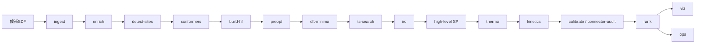
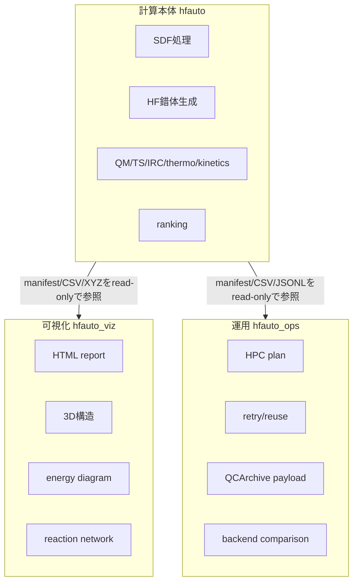
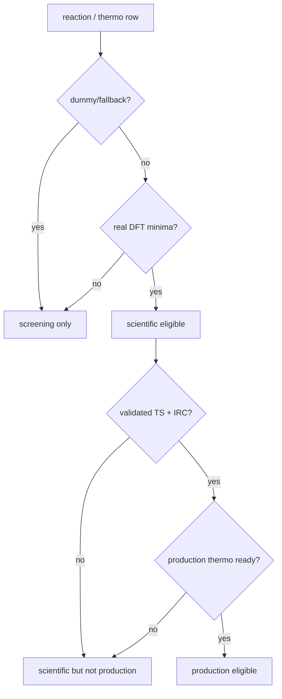

# HF気相反応性自動評価ワークフロー 技術レポート

**対象成果物**: `hfauto final baseline`  
**対象領域**: 半導体製造ガスプロセスにおけるHF反応性評価、HF捕捉剤・HF活性化添加剤・副生成物リスク評価  
**主入力**: 複数候補分子を含むSDFファイル  
**主出力**: HF会合自由エネルギー、プロトン移動障壁、HF活性化記述子、速度論指標、候補ランキング、構造・反応dossier、HPC運用計画  
**注意**: 本ベースラインは、ワークフロー、データ契約、可視化、運用、将来拡張の完成版である。実候補の科学的採否は、実xTB/CREST、実DFT、実TS/IRC、実熱補正、参照分子検証を通した `rank_production.csv` を用いて判断する。

---

## 要旨

半導体製造プロセスで用いられるHF含有ガス系では、添加剤や捕捉剤候補の選定において、単一分子の塩基性指標だけでなく、HFとの気相会合、プロトン移動、HFクラスター形成、温度・分圧依存性、ならびに反応速度論を統合的に評価する必要がある。本プロジェクトでは、複数候補分子をSDFとして入力し、候補分子 \(B\) と \((HF)_n\) との気相反応性を自動評価するワークフローを構築した。ワークフローは、構造標準化、公開データベース照合、反応サイト検出、配座探索、HF錯体生成、xTB/CREST前処理、DFT最適化・周波数、TS探索、IRC検証、高精度単一点補正、熱補正、TST速度論、ランキング、可視化、HPC運用計画からなる。

本手法の特徴は、各処理を `manifest.json` を介して独立実行可能なstageとして実装し、計算本体 `hfauto`、可視化 `hfauto_viz`、運用 `hfauto_ops` を分離した点にある。また、開発・スクリーニング用の結果と、科学的判断に利用可能な結果を混同しないように、`scientific_rank_eligible`、`production_rank_eligible`、`main_values_are_dummy`、`main_values_are_fallback` を明示し、`rank_screening.csv`、`rank_scientific.csv`、`rank_production.csv` を分離した。これにより、研究段階では高速な探索を行いつつ、本番判断では実DFT/TS/IRC/熱補正を満たした候補のみを採用できる。

---

## 1. 背景、目的、従来の課題

### 1.1 背景

HFは半導体製造における酸化膜反応、表面改質、エッチング、洗浄、残渣制御に関連する重要な反応性成分である。ガスプロセスでは、液相とは異なり溶媒和による強い安定化が存在せず、分子間水素結合、HFクラスター、添加剤との錯形成、気相分圧、滞留時間が反応性を支配する。候補分子がアミン、ピリジン、イミン、エーテル、スルフィド等の塩基性部位を持つ場合、HFとの反応は単純な一段階反応ではなく、以下の複数過程として扱う必要がある。

\[
B + (HF)_n \rightleftharpoons B\cdots(HF)_n
\]

\[
B\cdots(HF)_n \rightleftharpoons BH^+\cdots F(HF)_{n-1}^-
\]

\[
B\cdots(HF)_n + HF \rightleftharpoons B\cdots(HF)_{n+1}
\]

候補分子の目的がHF捕捉であるか、HF活性化であるかによって評価指標は異なる。HF捕捉剤では \(\Delta G_{\mathrm{assoc}}\)、イオンペア安定性、プロトン移動障壁、クラスター形成リスクが重要である。一方、HF活性化添加剤ではH–F結合伸長、HF伸縮振動数の赤方シフト、HF分極、ならびにSi–Oプローブ反応の障壁低下が重要となる。

### 1.2 目的

本手法の目的は、複数候補分子をSDFとして受け取り、半導体製造ガスプロセスに関連するHF気相反応性を、再現可能かつ段階的に評価することである。具体的には以下を目標とする。

1. 候補分子ごとに塩基性反応サイトを自動検出する。
2. \(B\cdots(HF)_n\)、\(BH^+\cdots F(HF)_{n-1}^-\)、TS候補、IRC経路を自動生成・管理する。
3. xTB/CREST、DFT、TS探索、高精度単一点、熱補正、速度論へ段階的に接続する。
4. 標準状態とプロセス分圧補正後の自由エネルギーを区別して出力する。
5. HF捕捉、HF活性化、HFクラスター成長リスクの観点でランキングする。
6. dummy/fallback値を本番判断に混入させないScience Gateを設ける。
7. 反応専門家・プロセスエンジニア・計算担当者が同じ成果物をレビューできる可視化とレポートを提供する。

### 1.3 従来の課題

従来の候補評価では、単一のプロトン親和力、p\(K_a\)、分子軌道指標、あるいは単発DFT計算で候補が比較されることが多い。しかし、HF気相反応では以下の課題が存在する。

| 課題 | 具体例 | 本手法での対応 |
|---|---|---|
| 会合反応のエントロピー効果 | \(B+HF\to B\cdots HF\) では標準状態とプロセス分圧で傾向が変わる | \(G(T,p)\) と \(\Delta G_{\mathrm{assoc}}(T,p)\) を明示 |
| 酸塩基・水素結合・クラスターが競合 | 1:1 HFだけでは \(FHF^-\) 安定化を見落とす | \(n=1,2,3\) を標準的に扱う |
| TS探索失敗が多い | HF移動では回転・クラスター再配列をTSと誤認 | 虚振動、mode overlap、IRC endpoint matchをQC化 |
| 配座依存性が大きい | 柔軟アミン、二座塩基、環状構造 | RDKit/CREST配座集合からHF錯体を生成 |
| 低振動数モードの熱補正が不安定 | 弱結合錯体のRRHOエントロピー過大評価 | GoodVibes/quasi-RRHO対応枠 |
| 計算ログが属人的 | どの計算が本物か、fallbackか不明 | Artifact、quality tier、science gateで管理 |
| 大量候補運用が難しい | 重複計算、HPC投入、失敗再実行 | `hfauto_ops` によるjob plan/retry/reuse |

---

## 2. 本手法の概要と従来課題への効果

### 2.1 全体思想

本手法は、単一のモノリシックな計算スクリプトではなく、各処理を独立stageとして定義する。各stageは `manifest.json` を入力し、処理結果を新しいArtifactとして追加した `manifest.json` を出力する。



この設計により、たとえば配座探索だけを差し替える、ORCAをPsi4やNWChemに置き換える、TS探索だけを再実行する、可視化だけを後から生成する、といった運用が可能になる。

### 2.2 パッケージ分離



この分離により、可視化やHPC運用の仕様変更が、量子化学計算ロジックを破壊しない。第三者レビューでは、`hfauto` は科学計算、`hfauto_viz` は成果物確認、`hfauto_ops` は運用監査、と明確に役割を分けられる。

### 2.3 Science Gate

現行ベースラインでは、開発・スクリーニング用のdummy/fallback値と、本番判断に使える値を分離するため、以下の3段階ランキングを出力する。

| 出力 | 内容 | 用途 |
|---|---|---|
| `rank_screening.csv` | すべての候補を含む。dummy/fallbackも含む | 配線確認、初期探索、可視化確認 |
| `rank_scientific.csv` | 実DFT minima以上の根拠を持つ行 | 科学レビューの入口 |
| `rank_production.csv` | TS/IRC検証とproduction thermochemistryを満たす行 | 候補採否、技術判断 |



---

## 3. 全体入出力と応用先

### 3.1 主入力

| 入力 | 形式 | 内容 |
|---|---|---|
| 候補分子 | SDF | 複数候補分子。SDF propertyとして社内ID、候補名、ロット等を保持可能 |
| pipeline設定 | YAML | 実行stage、温度、圧力、HFクラスターサイズ、backend設定 |
| method設定 | YAML | r2SCAN-3c、ωB97X-D4、DLPNO-CCSD(T)等のmethod ID |
| 公開DB fixture/cache | JSON/SQLite | PubChem, NIST, ATcT, CCCBDB, CompTox, NIOSH等 |
| 実行環境 | PATH/env | xTB, CREST, ORCA, GoodVibes, Arkane, Cantera等 |

### 3.2 主出力

| 出力 | 代表ファイル | 用途 |
|---|---|---|
| 候補要約 | `candidate_summary.csv` | 候補単位の総合判断 |
| HF捕捉ランキング | `rank_scavenger.csv` | HF捕捉・不活化候補抽出 |
| HF活性化ランキング | `rank_activation.csv` | HF活性化添加剤候補抽出 |
| Science Gate別ランキング | `rank_screening.csv`, `rank_scientific.csv`, `rank_production.csv` | 開発・科学・本番判断の分離 |
| 熱力学 | `species_thermo.csv`, `reaction_thermo.csv` | \(G(T,p)\), \(\Delta G\), \(K\) |
| 速度論 | `kinetics_records.csv` | TST/Wigner速度定数 |
| 可視化 | `15_viz/report.html` | 反応専門家・プロセス担当向けレビュー |
| 運用 | `16_ops/operations_report.html` | HPC投入、retry、reuse、backend比較 |

### 3.3 応用先

| 応用先 | 利用する主指標 | 出力 |
|---|---|---|
| HF捕捉剤探索 | \(\Delta G_{\mathrm{assoc}}\), \(\Delta G_{\mathrm{ionpair}}\), \(\Delta G^\ddagger_{\mathrm{PT}}\) | `rank_scavenger.csv` |
| HF活性化添加剤探索 | \(\Delta r_{HF}\), \(-\Delta \nu_{HF}\), moderate binding | `rank_activation.csv` |
| クラスター・粒子化リスク | \(\Delta G_{\mathrm{addHF}}\), cluster risk proxy | `cluster_risk.csv` |
| プロセス条件評価 | \(G(T,p)\), \(K_p\), \(k(T)\) | `reaction_thermo.csv`, `kinetics_records.csv` |
| EHS/物性レビュー | PubChem, CompTox, NIOSH flags | `public_data_coverage.csv` |
| 研究レビュー | 3D構造、TS、IRC、energy diagram | `15_viz/report.html` |
| 大量候補運用 | job array, retry, reuse | `16_ops/operations_report.html` |

---

## 4. 反応モデルと計算式

### 4.1 反応ファミリー

本手法では、候補分子 \(B\) とHFクラスター \((HF)_n\) の反応を以下の基本ファミリーとして扱う。

#### R1: HF会合

\[
B + (HF)_n \rightleftharpoons B\cdots(HF)_n
\]

\[
\Delta G_{\mathrm{assoc}}^\circ
=
G^\circ\left[B\cdots(HF)_n\right]
-
G^\circ[B]
-
G^\circ[(HF)_n]
\]

これはHF捕捉力、初期錯形成、HF活性化の入口を表す。明確なTSを持たない場合が多く、障壁ではなく平衡自由エネルギーとして扱う。

#### R2: プロトン移動・イオンペア形成

\[
B\cdots(HF)_n
\rightleftharpoons
BH^+\cdots F(HF)_{n-1}^-
\]

\[
\Delta G_{\mathrm{ionpair}}
=
G\left[BH^+\cdots F(HF)_{n-1}^-\right]
-
G\left[B\cdots(HF)_n\right]
\]

プロトン移動の活性化自由エネルギーは、TSが得られた場合に、

\[
\Delta G^\ddagger_{\mathrm{PT}}
=
G[TS]-G\left[B\cdots(HF)_n\right]
\]

として定義する。

#### R3: HF逐次付加・クラスター成長

\[
B\cdots(HF)_n + HF \rightleftharpoons B\cdots(HF)_{n+1}
\]

\[
\Delta G_{\mathrm{addHF}}(n)
=
G\left[B\cdots(HF)_{n+1}\right]
-G\left[B\cdots(HF)_n\right]
-G[HF]
\]

これはクラスター成長や低揮発性塩様種のリスク評価に使う。

#### R4: 将来拡張としてのSi–Oプローブ反応

\[
B\cdots HF + Si(OH)_4 \rightarrow B\cdots H_2O + FSi(OH)_3
\]

または、

\[
B\cdots HF + (HO)_3Si-O-Si(OH)_3
\rightarrow \mathrm{fluorinated\ silanol\ products}
\]

これは半導体製造ガスプロセスにおいて、HFが実際にSi–O結合へどの程度反応性を示すかを評価する拡張反応である。現行コードでは設計上の拡張点として整理されており、本番モデル化は将来拡張とする。

### 4.2 標準状態と分圧補正

気相プロセスでは標準状態だけでなく、プロセス分圧での自由エネルギーを用いる。

\[
G_i(T,p_i)=G_i^\circ(T,p^\circ)+RT\ln\left(\frac{p_i}{p^\circ}\right)
\]

一般反応

\[
\sum_i \nu_i A_i=0
\]

に対して、分圧補正は

\[
\Delta G(T,\{p_i\})=
\Delta G^\circ(T)+RT\ln Q_p
\]

\[
Q_p=\prod_i \left(\frac{p_i}{p^\circ}\right)^{\nu_i}
\]

で与える。会合反応では分子数が減少するため、低分圧条件で錯体形成が不利になる場合がある。このため、`reaction_thermo.csv` では標準状態値と分圧補正値を分ける。

### 4.3 高精度単一点補正式

構造・周波数を低〜中コストDFTで求め、高精度単一点で電子エネルギーを補正する場合、最終自由エネルギーを以下で近似する。

\[
G_{\mathrm{final}}
\approx
E_{\mathrm{SP}}^{\mathrm{high}}
+
\left(G_{\mathrm{thermal}}^{\mathrm{DFT}}-E_{\mathrm{el}}^{\mathrm{DFT}}\right)
\]

ここで \(E_{\mathrm{SP}}^{\mathrm{high}}\) はdouble-hybrid DFTやDLPNO-CCSD(T)等の高精度単一点、\(G_{\mathrm{thermal}}^{\mathrm{DFT}}\) はDFT周波数計算から得る熱補正込み自由エネルギーである。

### 4.4 TST速度論

TSが検証済みである場合、Eyring式を用いて速度定数を推定する。

\[
k_{\mathrm{TST}}(T)=\kappa(T)\frac{k_B T}{h}
\exp\left[-\frac{\Delta G^\ddagger(T)}{RT}\right]
\]

ここで \(\kappa(T)\) は透過係数である。軽原子であるHの移動ではトンネル補正が有効になる可能性があるため、一次近似としてWigner補正を利用する。

\[
\kappa_{\mathrm{Wigner}}
=1+\frac{1}{24}\left(\frac{h |\nu^\ddagger|}{k_B T}\right)^2
\]

ただし、Wigner補正は簡便な近似であり、非対称障壁や低温条件ではEckart補正、RRKM/Master Equation、あるいはpath integral系手法の検討が必要である。

---

## 5. 処理ワークフロー詳細

### 5.1 全体stage一覧

| Stage | 主入力 | 主出力 | 化学的役割 |
|---|---|---|---|
| `ingest` | SDF | `molecule` | 候補分子読込、標準化 |
| `enrich` | `molecule` | `molecule_enriched` | 公開DB照合、同定・物性補助 |
| `detect-sites` | `molecule` | `site` | N/O/S/π塩基性サイト検出 |
| `conformers` | `molecule`, `site` | `conformer` | 候補配座生成 |
| `build-hf` | `conformer`, `site` | `species`, `reaction` | HF錯体・イオンペア端点生成 |
| `preopt` | `species` | `species_preopt`, `calculation` | xTB前処理、幾何QC |
| `dft-minima` | `species_preopt` | `species_optimized`, `calculation` | DFT最適化・周波数 |
| `ts-search` | `reaction`, `species` | `reaction_validated`, TS | TS探索、虚振動QC |
| `irc` | `reaction_validated` | `reaction_path_validated` | TSの端点接続確認 |
| `sp` | optimized species | `calculation` | 高精度単一点補正 |
| `thermo` | `calculation`, `reaction` | `thermo` | \(G(T,p)\), \(\Delta G\), \(K\) |
| `kinetics` | `thermo` | `kinetics` | TST/Wigner、機構骨格 |
| `calibrate` | public data, thermo | validation tables | 参照値との整合確認 |
| `connector-audit` | connector artifacts | audit | production readiness確認 |
| `rank` | thermo, kinetics, descriptors | rankings | 候補ランキング |
| `viz` | latest manifest | report/dossier | 構造・反応・ランキング可視化 |
| `ops` | latest manifest | operations bundle | HPC、retry、reuse計画 |

---

## 6. 各処理の詳細説明

### 6.1 `ingest`: SDF読込と分子標準化

**目的**  
SDFに含まれる候補分子を、後段処理で扱いやすい `molecule` Artifactへ変換する。SDF propertyに含まれる候補ID、名称、社内管理番号等は保持する。

**主ライブラリ**

| ライブラリ | 用途 |
|---|---|
| RDKit | SDF読込、sanitize、canonical SMILES、InChIKey、3D座標有無判定 |
| Open Babel | 将来拡張としてファイル形式変換、SDF/MOL2/XYZ/PDB処理 |

RDKitはPythonから分子構造を扱うための基盤ライブラリであり、SDF処理、分子描画、距離幾何による3D構造生成等に利用できる [1]。

**出力例**

```text
molecule_records.jsonl
normalized.sdf
rejects.sdf
manifest.json
```

**独立実行の使い所**

```bash
hfauto ingest --sdf data/candidates.sdf --out runs/r001/00_ingest
```

SDFの構造不良、塩、混合物、形式電荷の問題を早期に検出するために使う。実計算前の品質確認として最初に実行する価値が高い。

**将来拡張**

- Tautomer/protomer enumeration
- salt stripping policy
- metal-containing species policy
- SDF property schema validation
- stereochemistry validation

---

### 6.2 `enrich`: 公開データベース照合

**目的**  
候補分子の同定、既知物性、プロセス適性、参照値を補助的に取得する。公開DBにヒットしない社内候補も処理を継続できるよう、DB照合は非必須とする。

**利用DBと用途**

| DB | 用途 |
|---|---|
| PubChem PUG-REST | CID、同義語、標準化構造、3D seed、基本物性 [2] |
| NIST WebBook | PA/GB、IR、熱化学、参照小分子 |
| ATcT | 高精度・内部整合的な熱化学値 [3] |
| NIST CCCBDB | 気相小分子の熱化学、振動数、双極子、ベンチマーク [4] |
| CompTox | 揮発性、毒性、暴露・用途関連情報 |
| NIOSH | 職業衛生、EHSレビュー対象フラグ |

**出力例**

```text
enriched_molecule_records.jsonl
public_db_enrichment_summary.csv
identity_conflicts.csv
```

**独立実行の使い所**

候補が公開既知物質か、社内新規物質かを判別する。揮発性やEHS情報が候補選定の制約になる場合、計算前のフィルタリングに使える。

**近似と限界**

公開DBのPA/GBやIRは、HF会合自由エネルギーそのものの代替ではない。塩基性傾向、同定、計算手法検証の補助として扱う。

---

### 6.3 `detect-sites`: 反応サイト検出

**目的**  
候補分子中のHF受容サイト、特にアミン、ピリジン様N、イミン、O、S、π塩基性部位を検出する。

**手法**  
RDKit SMARTSを用いたルールベース検出を行う。アミドN、ニトロN、ピロール型N、四級アンモニウムなどは低優先または除外する。

**出力例**

```text
site_records.jsonl
site_summary.csv
```

**独立実行の使い所**

候補分子のどの原子がHF相互作用部位として扱われるかをレビューする。反応専門家がsite検出ルールを確認・修正する入口となる。

**将来拡張**

- ML basicity predictor
- protomer/tautomer別site priority
- buriedness/steric accessibility descriptor
- electrostatic potential maximum/minimumによるsite検出
- Fukui function / local softnessによる反応点補助評価

---

### 6.4 `conformers`: 配座生成

**目的**  
候補分子 \(B\) の低エネルギー配座集合を生成する。HF錯体の安定性は候補分子の配座に強く依存するため、単一構造からの評価は避ける。

**現行手法**

| 方法 | 用途 |
|---|---|
| RDKit ETKDG | 初期3D配座生成 |
| MMFF/UFF | 軽い事前緩和 |
| CREST/xTB | GFN-xTBレベルでの配座・回転異性体探索 |

CRESTはConformer-Rotamer Ensemble Sampling Toolであり、xTB等の半経験的量子化学計算を用いて低エネルギー分子空間を探索する [5]。

**Boltzmann重み**

配座 \(i\) の相対自由エネルギーを \(\Delta G_i\) とすると、重みは

\[
w_i=\frac{\exp(-\Delta G_i/RT)}{\sum_j \exp(-\Delta G_j/RT)}
\]

で与える。ただし初期段階では相対電子エネルギーやxTBエネルギーを近似的に用いる。

**独立実行の使い所**

柔軟なアミン、多官能候補、環状アミンでは、HF配置前に配座集合を確認する。上位候補についてはCRESTのエネルギー窓やRMSD閾値を調整して再実行する価値がある。

**将来拡張**

- TS conformer search
- macrocycle用conformer protocol
- AIMNet2/UMA等MLポテンシャルを用いた初期探索
- constrained conformer search for HF-bound motif

---

### 6.5 `build-hf`: HF錯体・イオンペア端点生成

**目的**  
各候補分子、各反応サイト、各配座について、HF錯体、HFクラスター、イオンペア端点、反応recordを生成する。

**生成種**

```text
B
(HF)n
B···(HF)n
BH+···F(HF)n−1−
TS placeholder / TS seed
```

**代表反応座標**

\[
q=r(B-H)-r(H-F)
\]

反応物側では \(r(B-H)\) が長く \(r(H-F)\) が短い。生成物側では \(r(B-H)\) が短く \(r(H-F)\) が長い。

**出力例**

```text
species_records.jsonl
reaction_seed_records.jsonl
structures/**/*.xyz
```

**独立実行の使い所**

HF配置が化学的に妥当か、反応物と生成物の原子順が一致しているかを確認する。NEB-TSやIRCでは原子順の不一致が致命的な失敗要因になるため、このstageはTS探索前の重要なレビュー点である。

**将来拡張**

- multi-direction HF placement
- steric grid placement
- dual-site bridged HF
- chain/cyclic \((HF)_n\) template
- automatic collision avoidance
- electrostatic potentialに基づくHF初期配置

---

### 6.6 `preopt`: xTB前処理

**目的**  
DFT投入前にHF錯体、イオンペア、HFクラスター構造を低コストで緩和し、異常構造を除外する。

**主ライブラリ**

| ツール | 用途 |
|---|---|
| xTB | GFN2-xTB等による構造最適化 |
| CREST | HF付加後の配座再探索 |

**QC項目**

```text
r_HF_A
B_H_distance_A
B_H_F_angle_deg
hf_dissociated
proton_transferred_unintentionally
geometry_sane
```

**独立実行の使い所**

DFTコストを削減するための候補絞り込みに使う。HFが解離する、意図せずプロトン移動する、構造が崩壊する候補を早期検出できる。

**近似と限界**

xTBは高速で配座探索に適するが、HF、F\(^-\)、強水素結合、電荷分離TSのエネルギーを最終判断に使うには不十分な場合がある。xTB値はscreening用途に限定し、production rankingには実DFT以上を要求する。

---

### 6.7 `dft-minima`: DFT最適化・周波数計算

**目的**  
候補単体、HFクラスター、反応物錯体、イオンペア生成物のDFT最適化と周波数計算を行い、minimaであることを確認する。

**推奨method tier**

| Tier | 推奨手法 | 用途 |
|---|---|---|
| L1 | xTB/CREST | 配座・初期構造 |
| L2 | r2SCAN-3c, B97-3c | DFT構造・一次ランキング |
| L3 | ωB97X-D4/def2-TZVPPD | 上位候補のエネルギー補正 |
| L4 | revDSD-PBEP86-D4, DLPNO-CCSD(T) | 最終候補の高精度単一点 |
| L5 | Gaussian同条件比較 | 外部比較・監査 |

ORCAはNEB-TS、OptTS、IRC、DLPNO-CCSD(T)などを含む量子化学パッケージとして本ワークフローで主要backendに位置づけている [6]。

**QC**

```text
SCF converged
geometry converged
n_imag = 0
lowest frequency recorded
HF stretch identified
```

**独立実行の使い所**

HF錯体形成自由エネルギー、HF活性化記述子、イオンペア安定性の一次ランキングに使う。TS探索前にminimaが正しく得られているか確認する。

**将来拡張**

- Psi4/PySCF/NWChem backend本格化
- GPU4PySCF等による高速DFT
- counterpoise/BSSE補正
- SAPT/EDAによる相互作用成分分解

---

### 6.8 `ts-search`: 遷移状態探索

**目的**  
\(B\cdots(HF)_n \to BH^+\cdots F(HF)_{n-1}^-\) のプロトン移動TSを探索する。

**現行設計のbackend候補**

| backend | 概要 |
|---|---|
| ORCA NEB-TS | 反応物・生成物構造からTSを探索する二点法 [7] |
| constrained scan → OptTS | \(q=r(B-H)-r(H-F)\) に沿ったscanからTS初期構造を生成 |
| pysisyphus GSM/NEB | ORCAに限定しないchain-of-states/IRC制御 |

**TS QC**

```text
n_imag = 1
imag_freq_cm1 < -100
mode_overlap_score >= 0.7
imaginary mode follows proton transfer coordinate
```

**独立実行の使い所**

DFT minimaが得られた候補のうち、上位候補や反応性が高いと予想されるsiteだけを選んでTS探索する。TS探索は最も失敗しやすいstageの一つであるため、`hfauto failures` と `hfauto_ops retry_plan` により再探索対象を管理する。

**将来拡張**

- ZOOM-NEB-TS, FAST-NEB-TS, TIGHT-NEB-TS切替
- true Hessian-based mode projection
- TS conformer search
- automated fallback policy
- manual review queue for ambiguous TS

---

### 6.9 `irc`: 反応経路検証

**目的**  
得られたTSが目的の反応物錯体と生成物イオンペアを接続しているかを確認する。IRCはTSが本当に目的反応の一次鞍点であることを確認するための重要な検証である [8]。

**QC**

```text
real_irc_executed
irc_validated
reactant_endpoint_match
product_endpoint_match
endpoint_rmsd_A
endpoint_graph_match
```

**独立実行の使い所**

TSが見つかったが、反応経路として妥当か不明な場合に単独再実行する。反応dossierではIRC endpoint、反応座標、B–H/H–F距離変化を可視化する。

**将来拡張**

- ORCA IRC multi-frame parser
- true IRC path energy diagram
- endpoint reoptimization and graph matching
- NEB/IRC path comparison

---

### 6.10 `sp`: 高精度単一点補正

**目的**  
DFT構造・周波数を保持しつつ、電子エネルギーをより高精度なmethodで補正する。

**候補手法**

| 手法 | 用途 |
|---|---|
| ωB97X-D4/def2-TZVPPD | 非共有結合・反応障壁の上位候補補正 |
| revDSD-PBEP86-D4/def2-QZVPP | double-hybridによる高精度補正 |
| DLPNO-CCSD(T)/def2-TZVPP–QZVPP | 最終候補の高精度単一点 |
| CBS extrapolation | 小分子・最終検証 |

**独立実行の使い所**

DFT minima/TS/IRCが検証済みの上位候補に限定して行う。全候補に対して高精度SPを行う必要はない。

---

### 6.11 `thermo`: 熱補正・分圧補正

**目的**  
species-level \(G(T,p)\)、reaction-level \(\Delta G\)、平衡定数を計算する。

**主ツール**

| ツール | 用途 |
|---|---|
| GoodVibes | Gaussian/ORCA/NWChem/Q-Chem/xTB等の出力から準調和熱補正を計算 [9] |
| ORCA thermochemistry | ORCA内の熱化学出力 |
| 内部quasi-RRHO fallback | 開発・スクリーニング用の補助 |

**平衡定数**

\[
K=\exp\left(-\frac{\Delta G^\circ}{RT}\right)
\]

**独立実行の使い所**

同じDFT結果に対して温度や分圧条件を変更して再評価する。半導体装置条件が変わった場合、QM計算をやり直さず、thermo stageだけを再実行できる。

**限界**

低振動数モード、内部回転、弱結合錯体のエントロピーは近似依存が大きい。Production判断ではGoodVibesまたは同等のquasi-RRHO処理を明示し、low-frequency countを確認する。

---

### 6.12 `kinetics`: 速度論・反応器接続

**目的**  
検証済みTSからTST速度定数を計算し、Arkane/Canteraへ接続する。

**主ツール**

| ツール | 用途 |
|---|---|
| Arkane | Thermochemistry, TST, Master Equation計算 [10] |
| Cantera | 気相反応、熱力学、輸送、反応器計算 [11] |

**出力例**

```text
kinetics_records.csv
reactor_screening.csv
cantera_mechanism.yaml
arkane_tst_input.py
```

**独立実行の使い所**

プロセス温度や滞留時間を変えて候補間の反応速度感を比較する。初期段階ではTSTと簡易反応器proxy、本番ではArkane/Canteraによる詳細速度論へ移行する。

---

### 6.13 `calibrate`: 参照値との整合確認

**目的**  
公開DBのPA/GB、熱化学、振動数、双極子等を用いて、計算methodの傾向を検証する。

**主参照**

| 参照 | 用途 |
|---|---|
| NIST WebBook | PA/GB、IR、熱化学 |
| ATcT | 高精度熱化学 |
| CCCBDB | 小分子の振動数、双極子、熱化学 |

**注意**

PA/GBはHF会合自由エネルギーやTS障壁そのものではない。塩基性傾向とプロトン化傾向の検証proxyとして使う。

---

### 6.14 `rank`: 候補ランキング

**目的**  
候補ごとにHF捕捉、HF活性化、クラスターリスクを定量化し、意思決定表を作成する。

**HF捕捉スコアの概念**

\[
S_{\mathrm{scavenger}}
= w_1 z[-\Delta G_{\mathrm{assoc}}]
+ w_2 z[-\Delta G_{\mathrm{ionpair}}]
+ w_3 z[-\Delta G^\ddagger_{\mathrm{PT}}]
- w_4 z[\mathrm{cluster\ risk}]
- w_5 z[\mathrm{process\ penalty}]
\]

**HF活性化スコアの概念**

\[
S_{\mathrm{activation}}
= w_1 z[\Delta r_{HF}]
+ w_2 z[-\Delta \nu_{HF}]
+ w_3 z[-\Delta G^\ddagger_{\mathrm{probe}}]
+ w_4 z[\mathrm{moderate\ binding}]
- w_5 z[\mathrm{irreversible\ trapping}]
\]

現行コードでは、probe反応は将来拡張であり、\(\Delta r_{HF}\)、\(\Delta \nu_{HF}\)、\(\Delta G_{\mathrm{assoc}}\)、cluster riskを中心に評価する。

**独立実行の使い所**

熱補正やkineticsだけを更新した後、ランキングを再生成する。スコア重みを変えた感度解析にも利用できる。

---

### 6.15 `viz`: 可視化

**目的**  
反応専門家、シミュレーション担当者、半導体プロセス担当者が同じ成果物を見て議論できるよう、HTMLレポート、分子dossier、反応dossier、3D構造、エネルギーダイアグラム、反応経路ネットワークを出力する。

**主ライブラリ**

| ライブラリ | 用途 |
|---|---|
| 3Dmol.js | WebGLベースの3D分子表示 [12] |
| Plotly | インタラクティブHTMLグラフ、エネルギー図 [13] |
| RDKit MolDraw2D | 2D分子SVG、site highlight [14] |
| Graphviz | 反応経路ネットワーク、ノード画像 [15] |
| Chemiscope | 構造–物性探索 [16] |

**出力例**

```text
15_viz/report.html
15_viz/molecules/<mol_id>/dossier.html
15_viz/reactions/<reaction_id>/dossier.html
15_viz/networks/reaction_network_linked.html
```

**独立実行の使い所**

計算が完了したrunに対して後からレポートを再生成する。実験・プロセスチームへの共有資料として有用である。

---

### 6.16 `ops`: HPC・運用

**目的**  
大量候補をHPCで安全に回すため、job array、retry、reuse、backend比較、QCArchive payloadを生成する。

**出力例**

```text
16_ops/array_job_plan.csv
16_ops/retry_plan.csv
16_ops/reuse_plan.csv
16_ops/qcarchive_payloads.jsonl
16_ops/operations_report.html
```

**独立実行の使い所**

候補数が増えたとき、どの計算をHPCへ投入すべきか、どの失敗を再実行すべきか、重複計算候補はどれかを確認する。

---

## 7. 本コードの有用性と半導体製造ガス探索での活用範囲

### 7.1 有用性

本コードは、HF気相反応性評価に必要な複数の要素を一つの再現可能なワークフローに統合する。特に以下の点が有用である。

1. SDF候補をそのまま入力できる。
2. HF捕捉とHF活性化を別ランキングとして扱う。
3. HFクラスター \((HF)_n\) を明示的に扱う。
4. 標準状態とプロセス分圧を分ける。
5. dummy/fallbackをproduction rankから除外できる。
6. 反応構造、TS、IRC、エネルギー図をHTMLでレビューできる。
7. HPC運用と再実行計画まで含む。

### 7.2 活用範囲

| 活用場面 | 具体的利用 |
|---|---|
| 添加剤探索 | HFを適度に活性化し、不可逆捕捉しすぎない候補を抽出 |
| 捕捉剤探索 | HF会合・イオンペア化が強く、クラスターリスクが許容できる候補を抽出 |
| プロセス条件検討 | 温度・分圧・滞留時間を変えた \(G(T,p)\), \(k(T)\) 比較 |
| 候補絞り込み | xTB/CREST → DFT → TS/IRC → high-level SPの段階的選抜 |
| 解析レビュー | 反応dossier、3D構造、energy diagramを用いた専門家レビュー |
| 計算運用 | HPC job array、retry、reuseによる大量候補処理 |

### 7.3 現時点の精度位置づけ

現行ベースラインは、ワークフロー完成版であるが、production science validation前である。したがって、実候補の採否には以下を満たす必要がある。

```text
rank_production.csv に候補が存在する
real DFT minima がある
validated TS/IRC がある
production thermochemistry がある
必要に応じて high-level SP がある
reference campaignでmethod tierの妥当性が確認されている
```

---

## 8. 将来拡張性と高精度化

### 8.1 反応モデル拡張

#### HF配置の高度化

現行の線形HF配置に加え、以下を追加することで構造探索の網羅性を高められる。

```text
multi-direction HF placement
steric-grid placement
dual-site bridged HF
chain/cyclic HF cluster templates
ESP-guided HF placement
```

#### HFクラスターサイズ収束

\(n=1,2,3\) に加え、上位候補では \(n=4\) 以上の収束を見る。

\[
\Delta G_{\mathrm{addHF}}(n)
\to 0
\]

に近づくか、あるいは負に残り続けるかにより、クラスター成長リスクを判断する。

#### Si–Oプローブ反応

半導体プロセス活性化剤としての妥当性を見るには、Si–Oプローブ反応を追加する。

```text
probe_sioh_fluorination
probe_siloxane_cleavage
probe_f_transfer
```

---

### 8.2 電子状態計算の高精度化

| 区分 | 現行/標準 | 高精度化 |
|---|---|---|
| 構造探索 | xTB/CREST | ML potential + DFT refinement |
| DFT構造 | r2SCAN-3c | ωB97X-D4/def2-TZVPPD opt/freq |
| 単一点 | ωB97X-D4 | revDSD-PBEP86-D4, DLPNO-CCSD(T) |
| 弱相互作用 | D4分散 | SAPT/EDA, BSSE補正 |
| 熱補正 | GoodVibes/quasi-RRHO | hindered rotor, conformer ensemble thermochemistry |
| 速度論 | TST/Wigner | Eckart, RRKM/Master Equation, variational TST |

### 8.3 真のnormal modeとIRC/NEB path parser

現行可視化では、虚振動モードの近似表示に \(q=r(B-H)-r(H-F)\) を利用できる。将来的にはORCA Hessian、frequency output、normal mode vectorを直接parseし、真の虚振動モードを表示する。

### 8.4 公開DBと参照キャンペーン

Phase 13相当のproduction science validationでは、以下の参照分子を用いる。

```text
HF
NH3
methylamine
dimethylamine
trimethylamine
pyridine
aniline
water
methanol
isopropanol
```

比較対象は以下とする。

```text
NIST PA/GB
ATcT thermochemistry
CCCBDB vibrational frequencies / dipoles
Gaussian同条件計算
ORCA / Psi4 / PySCF / NWChem backend差分
```

### 8.5 表面・クラスターDFTへの拡張

本ワークフローは気相反応に限定しているが、将来的には以下へ接続できる。

| 拡張 | 目的 |
|---|---|
| Si(OH)4 / disiloxane cluster | 表面Si–O反応の気相proxy |
| amorphous SiO2 cluster | より現実的な局所環境 |
| periodic slab DFT | 表面反応障壁、吸着、脱離 |
| microkinetic model | 反応器・表面反応統合 |

---

## 9. コード設計と保守性

### 9.1 設計原則

本コードは以下の原則で設計されている。

```text
1. 各処理はmanifest入力、manifest出力
2. 計算本体・可視化・運用を分離
3. dummy/fallbackとproduction結果を明確に区別
4. backendは差し替え可能
5. 実行結果はArtifactとして追跡
6. 可視化とopsはread-only consumer
7. stage単独実行とpipeline実行の両方をサポート
```

### 9.2 パッケージ構造

```text
hfauto/
  core/
  chemistry/
  stages/
  backends/
  workflow/

hfauto_viz/
  renderers/
  reports/
  structure/

hfauto_ops/
  core/
  schedulers/
  qcarchive/
  reports/
```

### 9.3 推奨利用コマンド

```bash
# ワークフロー確認
hfauto pipeline --config configs/pipelines/recommended_offline.yaml --run-id demo

# 主要出力確認
hfauto outputs runs/demo

# 科学的利用可否確認
hfauto science-status runs/demo

# 次アクション確認
hfauto next-actions runs/demo

# 可視化再生成
hfauto-viz report runs/demo --out runs/demo/15_viz

# HPC運用バンドル生成
hfauto-ops bundle runs/demo --out runs/demo/16_ops
```

---

## 10. まとめ

本ワークフローは、SDF形式の複数候補分子に対して、HF気相反応性を段階的に評価するための実装基盤である。HF会合、プロトン移動、HFクラスター、熱補正、速度論、公開DB較正、可視化、HPC運用を統合し、反応専門家・シミュレーション担当者・半導体プロセス技術者が同じ成果物を用いて議論できるように設計した。

現時点の完成ベースラインは、実計算前の配線確認、開発、レビュー、将来拡張の土台として利用できる。一方、候補採否の科学的判断には、実xTB/CREST、実DFT、実TS/IRC、GoodVibes等のproduction thermochemistry、高精度SP、参照分子キャンペーンによる検証が必要である。このため、dummy/fallback値は `rank_screening.csv` に限定し、本番判断では `rank_production.csv` のみを用いる設計とした。

今後は、reference campaignによりmethod tierごとの信頼性を定量化し、Si–Oプローブ反応や表面クラスターモデルへ拡張することで、半導体製造ガス探索における候補分子評価基盤としての有用性をさらに高められる。

---

## 参考文献・ソフトウェア文献

[1] RDKit Documentation, *Getting Started with the RDKit in Python*. https://www.rdkit.org/docs/GettingStartedInPython.html  
[2] PubChem, *PUG-REST Documentation*. https://pubchem.ncbi.nlm.nih.gov/docs/pug-rest  
[3] Active Thermochemical Tables, *ATcT Home*. https://atct.anl.gov/  
[4] NIST, *Computational Chemistry Comparison and Benchmark Database*. https://cccbdb.nist.gov/  
[5] CREST Documentation, *Conformer-Rotamer Ensemble Sampling Tool*. https://crest-lab.github.io/crest-docs/  
[6] ORCA Manual and Tutorials, *ORCA 6.1 documentation*. https://www.faccts.de/docs/orca/6.1/  
[7] ORCA Tutorial, *Finding Transition States with NEB-TS*. https://www.faccts.de/docs/orca/6.1/tutorials/react/nebts.html  
[8] ORCA Tutorial, *Intrinsic Reaction Coordinate*. https://www.faccts.de/docs/orca/6.1/tutorials/react/irc.html  
[9] GoodVibes Documentation, *Quasi-harmonic thermochemical corrections*. https://goodvibespy.readthedocs.io/en/latest/source/README.html  
[10] RMG-Py Documentation, *Arkane Introduction*. https://reactionmechanismgenerator.github.io/RMG-Py/users/arkane/introduction.html  
[11] Cantera, *Open-source chemical kinetics, thermodynamics, and transport*. https://cantera.org/  
[12] 3Dmol.js Documentation, *WebGL molecular visualization*. https://3dmol.csb.pitt.edu/doc/index.html  
[13] Plotly, *Interactive HTML export in Python*. https://plotly.com/python/interactive-html-export/  
[14] RDKit, *rdkit.Chem.Draw package*. https://www.rdkit.org/docs/source/rdkit.Chem.Draw.html  
[15] Graphviz Documentation, *Node attributes and image attribute*. https://graphviz.org/docs/nodes/  
[16] Chemiscope Documentation, *Interactive structure-property visualization*. https://chemiscope.org/docs/  
[17] NIST CCCBDB citation page, *NIST Standard Reference Database Number 101*. https://cccbdb.nist.gov/creditsx.asp  
[18] Cantera Python Documentation, *Solution objects and thermodynamic/kinetic properties*. https://cantera.org/3.2/python/index.html
