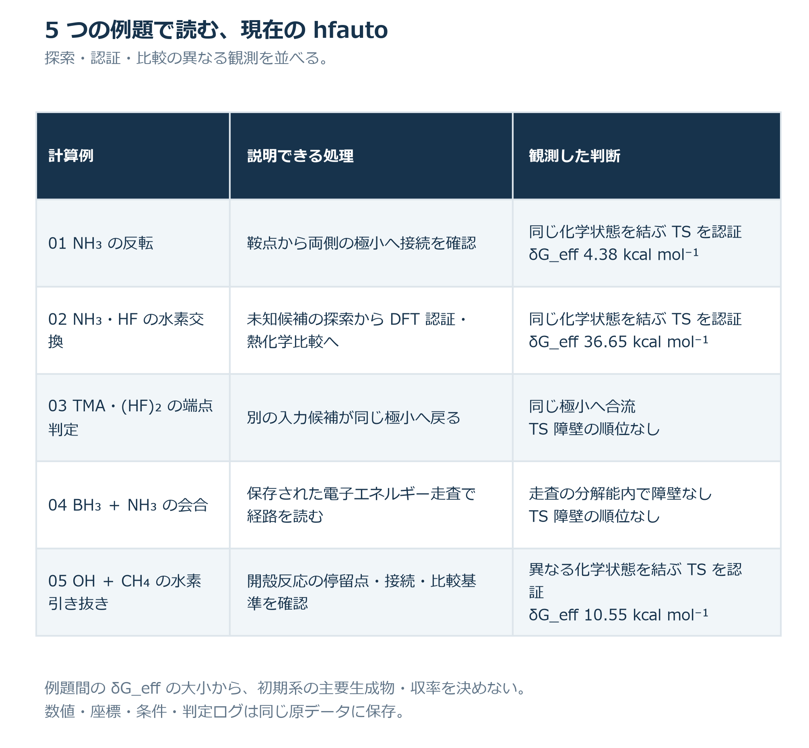
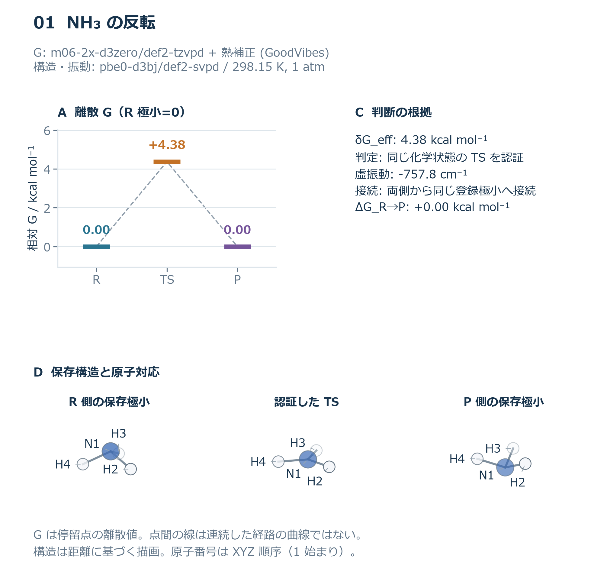
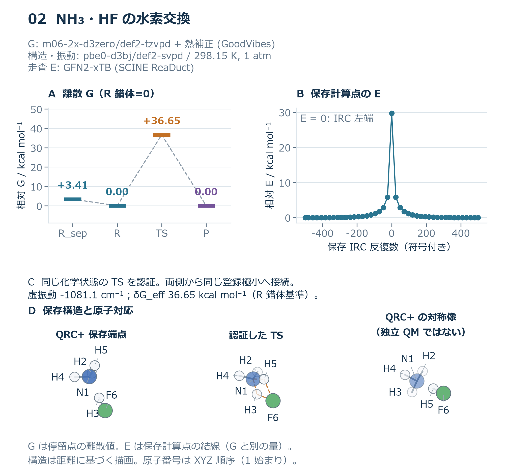
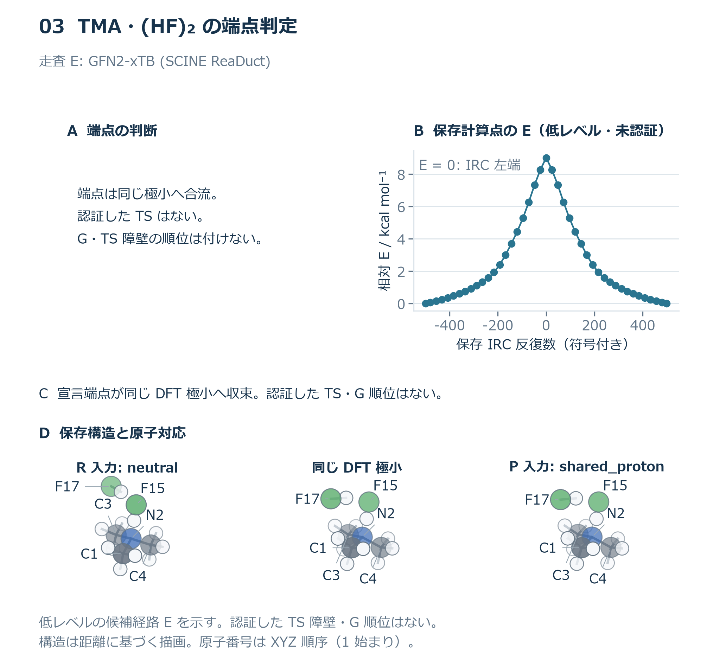
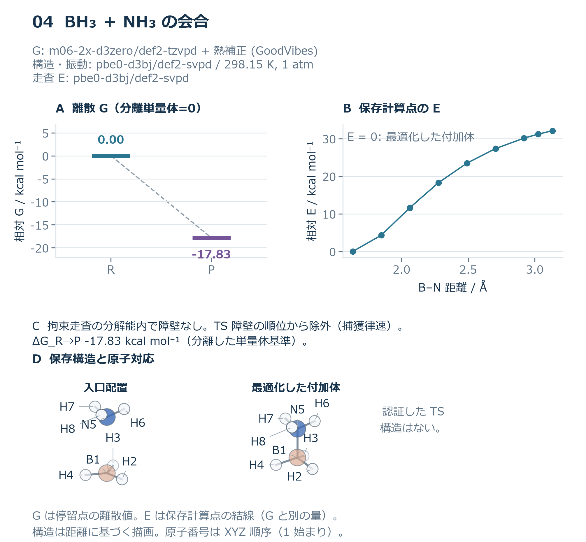
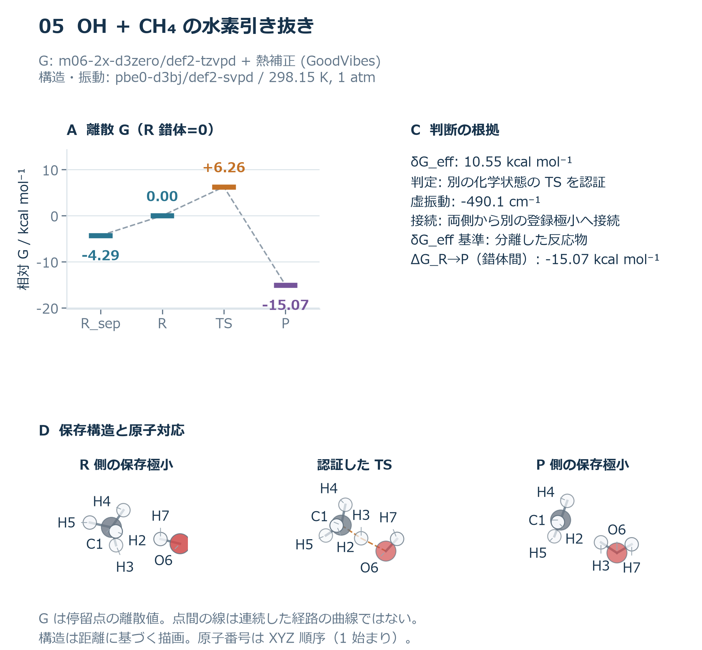
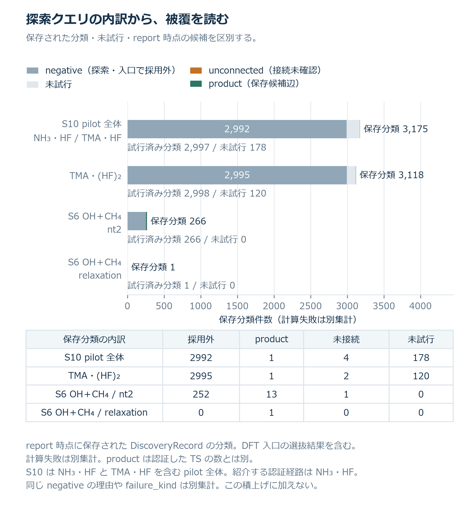
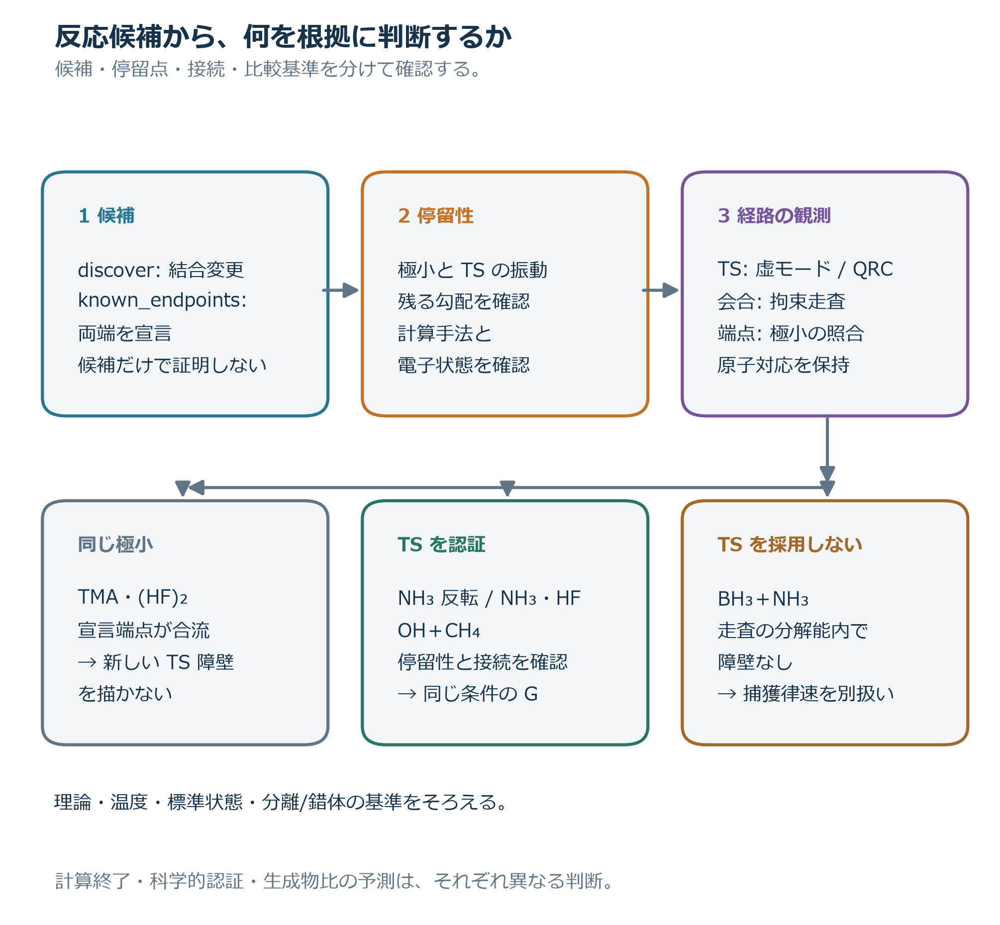

# hfautoによる反応候補探索と量子化学的経路検証

手法と計算済み例題の技術レポート

2026年10月6日

## 要旨

hfautoは、分子構造から反応候補を生成し、量子化学計算によって極小・遷移状態（TS）・端点接続を確かめ、指定した条件で反応の自由エネルギーを比較する研究用ワークフローである。低費用のGFN2-xTB探索とDFTによる経路検証を段階的に組み合わせ、構造、エネルギー、判断根拠を対応付けて保存する。本レポートでは、NH₃反転、NH₃・HFの水素交換、TMA・(HF)₂の極小への合流、BH₃＋NH₃の会合、OH＋CH₄の水素引き抜きの5例を示す。これらの例から、未知候補の発見、安定状態の同一性の判定、反応形式に応じた経路検証、比較基準を明示した熱化学評価という本手法の機能を説明する。

対象コード hfauto 0.14.0　コード説明の基準 d436a5a　結果資料 W3〜W5の保存計算

## 1 背景と目的

反応の予測には、生成物候補を考える仕事と、その候補へ至る経路を計算で確かめる仕事がある。分子間の向きや配座、結合形成・切断の組合せによって候補数が増える一方、DFTによる最適化、振動解析、遷移状態探索には計算費用がかかる。自動反応探索は、広い候補生成と精密な検証を接続することで、研究者が調べるべき機構を具体的な構造と数値へ変換する［1–4］。

hfautoはこの接続を、入力から報告までの明確な計算段階として実装する。研究者は構造、電荷、多重度、計算手法、温度、探索予算を指定し、候補経路、認証された反応形式、相対自由エネルギー、探索範囲を得る。保存した構造と計算記録を用いることで、第三者も結論に至る根拠を追跡できる。

表1 研究目的と提供する成果

| 目的 | 利用者が得る成果 |
| --- | --- |
| 未知の反応候補の発見 | 生成物を指定しない探索から、到達構造、低レベルTS候補、状態間の辺を取得する。 |
| 検証済み候補の条件付き比較 | DFTの停留点と接続を揃え、理論・温度・標準状態を明示して反応量を比較する。 |
| 継続して利用できる基盤 | 責務ごとのコード構成、保存記録、計算再利用、再開、CSV・HTML表示を提供する。 |
| 初期系からの経路評価への展開 | 蓄積した状態と検証済み経路を、初期量と速度モデルを用いる反応網評価へ接続する。 |

本レポートの実証対象は、現行コードが提供する個別反応の探索・検証・熱化学比較である。初期系からの時間依存の主要生成物評価は、この基盤を用いる次の開発段階として位置付ける。

## 2 手法

### 2.1 入力から比較結果までの計算段階

入力はXYZまたはSMILESの構造、各化学種の電荷・多重度、分子の組合せからなる。既知の両端を調べるknown_endpointsと、生成物を指定しないdiscoverを選べる。discoverでは、構造を生成し、低レベル探索で候補を広げ、DFTへ進める候補を選び、最後に熱化学を評価する。表2は各段階が受け取り、次段へ渡す成果を示す。

表2 各計算段階の責務と入出力

| 段階 | 主な入力 | 担当する処理 | 主な出力 |
| --- | --- | --- | --- |
| structures | 構造、電荷、多重度、組成 | 構造を化学種へ変換し、原子順と化学状態を定義する。 | 構造と状態ラベルを持つ化学種記録 |
| conformers | 化学種と分子の組合せ | 配座と分子間の開始配置を生成する。 | 状態ごとの候補構造群 |
| `minima(screen)` | 候補構造 | GFN2-xTBで最適化・振動解析し、極小を登録する。 | 低レベル極小と状態変化 |
| explore | 低レベル極小、探索予算 | 結合編集を列挙し、NT2と経路計算で多世代の候補を得る。 | 両端構造、TS候補、相対E、世代、探索記録 |
| `minima(dft)` | 発見した辺と入力端点 | DFT入口を選択し、最適化・振動解析で極小を確定する。 | DFT極小と計算観測 |
| `reaction-paths` | DFT極小対、TS候補、反応仮説 | 経路、鞍点、虚振動、両側接続を検証する。 | 反応区分、認証TS、端点接続 |
| sp | 比較に必要な極小・TS | 指定したエネルギー層で一点計算する。 | 保存構造に対応する電子エネルギー |
| thermo | 構造、Hessian、E、温度・標準状態 | 熱補正と状態のGを求め、反応量を計算する。 | G、ΔG‡、ΔG_rxn、δG_eff、感度幅 |
| report | 反応区分、熱化学、探索記録 | 比較表と根拠をCSV・HTMLへ表示する。 | 順位、探索範囲、個別反応の説明 |

探索では状態間の候補を蓄積し、DFT段階では比較に必要な点へ計算を集中させる。入力で指定した端点も発見した端点も、同じ極小取得・経路検証の手順へ渡るため、既知反応の検証と未知候補の探索を共通の成果形式で扱える。

### 2.2 反応候補生成と化学状態の識別

配座生成ではCRESTとGFN2-xTBを用い、単量体の内部配座と分子間の開始配置を標本化する［2,3］。生成物探索では、結合形成1〜2本・切断0〜2本の局所編集を列挙する。RDKitによるグラフの正準化と原子の等価クラスを使い、同じ化学的試行をまとめる［5］。到達した状態から次世代を探索することで、初期の構造から複数の状態へ候補を展開する。

SCINE ReaDuctのNT2は、形成・切断を調べる原子対へ人工力を与えてTS候補を生成する［1］。続く低レベルTS最適化、IRC、両端の最適化により、探索候補の構造と電子エネルギーを得る。経路初期化にはpysisyphusのCI-NEBとTSOptも用いる［4］。GFN2-xTBの候補をDFTへ渡す入口では、DFT//xTBの一点エネルギーと到達関係を使って、精密化する辺を選ぶ。

化学状態は結合グラフと立体情報で識別し、極小は同じ理論レベルのエネルギーと原子対応を持つRMSDで登録する。現在の極小同一性の基準はRMSD ≤ 0.05 Å、エネルギー差 ≤ 5×10⁻⁵ Ehである。ラベル付き構造の比較も保持するため、同じ化学状態に属するNH₃反転や水素交換を、具体的な配置変化として追跡できる。

### 2.3 極小と遷移状態を経路へ結び付ける

DFT段階ではPBE0-D3(BJ)/def2-SVPDを用いる［6–9］。極小は最適化と振動解析で確定する。TS候補は鞍点最適化の後、独立したHessian（力定数行列）計算で一次の鞍点を確認する。結合変化または宣言した反応座標を持つ仮説では、虚モードとの質量加重した重なりχ ≥ 0.3を確認し、反応方向との対応を評価する。勾配とHessianによる停留性の評価も、点の認証と比較への採用に用いる。

端点接続にはQRCを用いる［10］。受理したTSの虚モードの正負両方向へ構造を変位し、同じ計算面で各側を極小まで最適化する。到達した極小を登録済みの状態へ割り付け、期待した端点対、縮退した配置変化、別の端点対を結ぶ経路として整理する。経路上に中間の井戸を取得した場合は、その構造から子反応を構成する。

会合経路では、形成結合の距離を拘束したDFT緩和スキャンを用いる。電子エネルギーの山と井戸を1.0 kcal/molの分解能で分類し、最大の内部節点に隣接する区間へ中点を一度追加して形状を確認する。これにより、一次鞍点を経由する反応と、調べた分解能内で障壁なしの会合を、それぞれに適した計算手順で評価する。

### 2.4 熱化学と比較基準

停留点の自由エネルギーGは、精密化した電子エネルギーと、保存した構造・Hessianから得る核運動の熱補正を組み合わせて求める。既定の電子エネルギー層はM06-2X-D3(0)/def2-TZVPDである［7,8,11］。GoodVibesによるqRRHOエントロピーとQHエンタルピーの補正に、回転対称数、電子準位・スピン縮重、光学異性体の寄与を加える［12–14］。

$$
G_i(T,p^\circ)=E_i^{\mathrm{SP}}+G_i^{\mathrm{nuc}}+G_i^{\mathrm{el}}+G_i^{\mathrm{opt}}
$$

式のSPは一点電子エネルギー、nucは並進・回転・振動の補正、elは電子項、optは光学異性体の寄与を表す。核運動補正にはPBE0層のHessianを使い、回転対称数は受理した真回転の操作から数える。pymsym/libmsymはその操作集合への点群名付けを担当する［15］。低振動数カットオフは既定100 cm⁻¹で、50・100・150 cm⁻¹の感度を記録する。

表3 本レポートの共通計算条件

| 計算項目 | 条件 |
| --- | --- |
| 低レベル探索 | GFN2-xTB。ReaDuct探索の電子温度300 K |
| 極小・TS・振動 | PBE0-D3(BJ)/def2-SVPD |
| Gの電子エネルギー | M06-2X-D3(0)/def2-TZVPDの一点計算 |
| Gの熱補正 | PBE0層の構造・Hessianに基づくqRRHO/QH |
| 温度・標準状態 | 気相、298.15 K、1 atm |
| 電荷・多重度 | 各入力で指定。OH＋CH₄は電荷0・二重項、他の掲載系は電荷0・一重項 |
| 比較の感度 | 低振動数補正設定を変えた反応量の幅 |

反応の局所障壁ΔG‡はTSと反応物Rの差、反応自由エネルギーΔG_rxnは生成物PとRの差として定義する。分離した単量体が与えられた場合、そのGの和も比較点として保存する。分離系と錯体を図中に並べることで、会合の寄与とTSへの上りを一つの基準から読める。

$$
\Delta G^\ddagger=G_{\mathrm{TS}}-G_{\mathrm R},\qquad \Delta G_{\mathrm{rxn}}=G_{\mathrm P}-G_{\mathrm R}
$$

δG_effは、個別反応の点の鎖を進む際に、それまでに通過した最も低い井戸から測った最大の上りである。その定義は次式で表され、𝒲は鎖の極小点の集合を表す。

$$
\delta G_{\mathrm{eff}}=\max_k\left[G_k-\min_{\substack{j\le k\\ j\in\mathcal W}}G_j\right]
$$

鎖には利用可能な分離反応物、反応物錯体、TS、生成物、分離生成物を配置する。順位表はこの量とreference列を用いて、同じ条件の検証済み候補を比較する。障壁なしの会合は、反応自由エネルギーを持つ会合結果として別表に整理する。

図ではGの離散停留点とEの計算経路を別のパネルに置く。G図は認証した状態の比較、E図はその手法で実際に計算した節点の推移を示す。各図のゼロ、単位、横軸、計算層を明記することで、研究者は熱力学的な比較と探索・走査の形状を対応付けて解釈できる。

### 2.5 計算エンジンとライブラリの役割

hfautoは既存の量子化学・探索ライブラリを、候補生成、精密化、熱化学という役割で組み合わせる。表4の版は今回確認した本番環境と固定設定に基づく。ソフトウェアの手法は参考文献で説明し、掲載例題の数値と構造はhfautoの保存計算から取得する。

表4 使用する計算部品とその成果

| 部品 | 使用版 | hfautoでの役割 |
| --- | --- | --- |
| NWChem［16］ | 7.2.3 | DFT最適化、鞍点、勾配・Hessian、ZTS string、一点計算。追加校正にはCCSD(T)も利用する。 |
| xTB［2］ | 6.7.1 | GFN2の低費用なエネルギー、最適化、振動計算を担当する。 |
| CREST［3］ | 3.0.2 | 状態内の配座と開始配置を標本化する。 |
| SCINE ReaDuct［1］ | 6.1.0 | NT2、TS最適化、低レベルIRC、両端最適化を担当する。utilities 10.1.0、xTB wrapper 3.0.2で計算器へ接続する。 |
| pysisyphus［4］ | 1.0.0 | GFN2のCI-NEB・TSOptで初期経路とTS候補を用意する。 |
| RDKit［5］ | 2026.03.3 | SMILESから3D構造を作り、正準化・立体・原子等価性で状態と編集を整理する。 |
| GoodVibes［12］ | 4.3.0 | 保存振動数と条件から核運動の熱補正を計算する。 |
| pymsym／libmsym［15］ | 0.3.5 | hfautoが受理した対称操作に点群名を付ける。 |
| NumPy／SciPy | 2.4.6／1.18.0 | 線形代数、Hessian射影、原子対応、数値最適化を支える。 |
| Matplotlib［17］ | 3.11.0 | 保存結果を拡大可能なSVGと300 dpi PNGへ作図する。 |
| 3Dmol.js［18］ | 2.5.5 | 保存XYZをブラウザーで球棒表示し、回転、原子ラベル、距離測定を提供する。 |

SCINEについて本コードが直接利用するのはReaDuctとその計算器接続である。Chemoton 2.0の原論文はNT2探索の方法を参照するために引用している。図のDFT認証と熱化学比較は、hfautoのdriverとchemistryが組み立てる。

### 2.6 責務を分けた実装と再現可能な運用

計算段階とソフトウェアの層は役割を分けている。stageは成果の受渡し、driverは有限の計算手順、chemistryは化学・数理の判断を担当する。外部エンジンへの翻訳と実行・保存を別の層に置くことで、同じ化学判定を複数の計算手順から利用できる。

表5 コードの層と成果の関係

| 層 | 責務 | 入力から出力への関係 |
| --- | --- | --- |
| core | 必要な共通記録を定義する。 | 構造、理論、計算観測、反応、熱化学を共通の記録へ表現する。 |
| chemistry | 数理と化学的判定を実装する。 | 構造、E、Hessianから状態同一性、振動、接続判定、熱化学を返す。 |
| drivers | 有限の計算手順を組み立てる。 | 極小・反応の問いからエンジンへ計算を依頼し、成果を解釈する。 |
| stages | 各段階の入出力を受け渡す。 | 前段の記録を集め、担当処理の成果を保存する。 |
| backends | 計算器への翻訳と観測を担う。 | 分子・手法・要求を入力へ変換し、原出力から観測を取得する。 |
| execution | 保存、再利用、再開、資源を管理する。 | 計算鍵に対応するジョブ、原出力、継続情報を保持する。 |
| reporting | 成果を読み手へ表示する。 | 保存された反応・熱化学・探索記録を表とHTMLへ変換する。 |

CLIとpipelineは設定を読み、これらの処理を実行する入口である。利用者はsystem設定に構造と電子状態、method設定に理論レベル、site設定にエンジンの版と計算資源を与える。異なる反応系も同じ段階へ投入でき、結果はrunディレクトリへ蓄積される。

ジョブの鍵には構造、手法、計算条件、エンジン版を含める。再実行時は条件が対応する保存済み計算を再利用し、中断した最適化は最後の構造から継続する。コア数とメモリをsite設定で管理し、探索の件数予算と未試行の範囲を記録する。この運用により、計算の積上げと段階ごとの再評価を行える。

標準の成果はranking.csv、coverage.csv、method_panel.csv、report.htmlと、個別反応の判断ログである。今回の例題資料は保存記録から数値・XYZ・出所を抽出し、Matplotlibと3Dmol.jsで第三者向けの図へ変換した。抽出、作図、表示の責務も分けているため、追加の例題を同じ方式で再生成できる。

## 3 計算結果

### 3.1 五つの例題が示す計算機能

以下はW3〜W5の保存計算を同じ表示規約で整理した、個別経路処理の例証である。図1はそれぞれの問いと得られる判断を示し、表6は同じ温度・標準状態における数値をまとめる。図2〜6で構造とエネルギーを対応付け、図7〜8で探索範囲と反応判断を統合する。



図1　5例題の位置付け。反応の認証、状態の合流、会合の走査、条件付き比較を、異なる化学的な問いに対応付ける。

表6 計算された反応量と比較基準

| 例題と分類 | δG_eff<br>kcal/mol・基準 | ΔG_rxn<br>kcal/mol・基準 | 虚振動<br>cm⁻¹ |
| --- | --- | --- | --- |
| NH₃反転<br>縮退転位 | 4.38<br>極小 | 0.00<br>端点間 | 757.8i |
| NH₃・HF<br>縮退転位 | 36.65<br>錯体 | 0.00<br>端点間 | 1081.1i |
| TMA・(HF)₂<br>同一極小 | — | — | — |
| BH₃＋NH₃<br>障壁なしの会合 | — | -17.83<br>分離→付加体 | — |
| OH＋CH₄<br>素反応 | 10.55<br>分離反応物 | -15.07<br>錯体間 | 490.1i |

表6の各値は表中の基準に対する量である。NH₃反転とNH₃・HFは同じ化学状態を結ぶ縮退した経路、OH＋CH₄は異なる化学状態を結ぶ素反応として記録される。TMAの同一極小への合流とBH₃＋NH₃の会合も、後段で利用できる明確な反応区分を与える。

### 3.2 NH₃の反転経路

NH₃の平面構造から、窒素が水素原子の面を横切る反転経路を調べた。PBE0で得た平面の鞍点は757.8i cm⁻¹の虚振動をもち、その両側から三角錐の極小へ接続した。自由エネルギー図では反応前後を0、TSを4.38 kcal/molと評価した。



図2　NH₃反転のG、判断、構造。Gは反応前の極小をゼロとする。両側の構造は保存されたmode-followの極小、TSは振動計算構造である。破線は離散状態の順序を示す。

図2の構造を並べると、同じ原子対応を保ったまま反転運動を追える。上下の三角錐は同じ化学状態に登録され、その間のTSと接続が縮退転位の判断を与える。この例は、入力構造の停留性を調べ、幾何の変化と化学状態の同一性を併せて判定できることを示す。

利用者は反転前後の構造とTS、虚振動、相対Gを一組の成果として得る。3Dビューアでは三角錐と平面を回転して比較し、同じ元素・番号を持つ原子の配置を確認できる。

### 3.3 NH₃とHFの水素交換

生成物を指定しない候補探索から、NH₃・HFの水素交換経路を得た。DFT認証で1081.1i cm⁻¹の虚振動と両側の接続を確認し、同じ化学状態を結ぶ縮退転位に分類した。錯体基準の障壁は36.65 kcal/mol、分離反応物基準では33.24 kcal/molである。



図3　NH₃・HFの水素交換。Aは錯体をゼロとするG、BはGFN2-xTB IRCの保存軌跡から選んだ43節点、CはDFT認証の根拠、Dは原子対応を保持した構造。BのEのゼロは左端に置いたbackward IRCの最終点である。P側は実装が再利用したQRC＋端点の対称像であり、独立したQM計算とは区別して表示する。

図3Aでは分離反応物が錯体より3.41 kcal/mol高い。この会合寄与を明示すると、同じTSに対する二つの障壁基準を数値で説明できる。図3Dの原子番号から、水素の配置交換を追える。低レベルIRCは電子エネルギーの探索経路、DFTのQRCは端点接続の証拠として、それぞれの役割を持つ。

この経路はNH₃・HFとTMA・HFを含むpilotから得られたNH₃・HF由来の成果である。候補生成、TS精密化、接続認証、熱化学という一連の処理によって、探索で得た構造を比較可能な経路へ変換できる。

### 3.4 TMAと二分子のHFの状態合流

トリメチルアミンTMAと二分子のHFについて、中性型neutralとプロトン共有型shared_protonを端点候補として入力し、各構造をDFTで最適化した。二つの入力は同じ登録極小へ収束し、same_basinと判定された。



図4　TMA・(HF)₂の入力候補と共通極小への合流。Gの障壁に相当するAの領域は状態合流の説明とし、Bには別のNT2候補から得たGFN2-xTB IRCの保存軌跡から選んだ43節点を示す。Eのゼロは左端に置いたbackward IRCの最終点である。入力候補、到達極小、低レベルの候補経路を対応する出所で表示する。

図4の構造比較は、二つの仮説から共通の安定状態へ至る関係を示す。状態同一性の判定により、宣言した名前と計算で得られた極小を対応付け、反応の比較対象を選べる。掲載した低レベルIRCは探索が得た候補の経過を示し、宣言端点のDFT結果は同一極小への合流として確定する。

この例が提供する成果は、開始配置から安定状態への対応と、計算済み探索候補の記録である。利用者は得られた極小を次の探索の起点として扱い、入力構造の違いを状態の数え上げへ反映できる。掲載データは完了したW4 runに基づく。

### 3.5 BH₃とNH₃の会合

BH₃とNH₃のルイス酸・塩基会合について、B–N距離を変えた拘束走査8点と中点の一点計算を評価した。電子エネルギーの推移は付加体への下降を示し、調べた経路の分解能内で障壁なしと判定した。分離した最適化単量体のGの和を基準に、付加体の反応自由エネルギーは−17.83 kcal/molとなった。



図5　BH₃＋NH₃の会合。Aは分離単量体の和をゼロとするG、Bは最適化付加体の電子EをゼロとするB–N拘束走査と中点、Dは接近入力と付加体を示す。3Dビューアでは孤立したBH₃、NH₃、付加体を選択できる。

図5BではB–N距離の減少に伴う電子エネルギーの低下を、実際の計算節点で読める。図5Aは標準状態の熱補正を含む会合の自由エネルギーを示す。両パネルを併せることで、経路形状と会合の熱力学という二つの問いを整理できる。

この結果はbarrierless_at_resolutionとして保存され、会合結果の表へ渡る。反応形式に応じて拘束走査を選ぶことで、TSの精密化と同じ基盤上で会合も評価できる。捕獲速度の評価は、得られた会合経路に速度モデルを接続する段階で行う。

### 3.6 OHとCH₄の水素引き抜き

OHラジカルによるCH₄の水素引き抜きを、電荷0・二重項として評価した。認証TSの490.1i cm⁻¹の虚振動とQRCの両側接続を確認し、OH＋CH₄とH₂O＋CH₃を結ぶ素反応として整理した。



図6　OH＋CH₄の引き抜き。G図はR錯体をゼロとし、分離したOH＋CH₄を−4.29、TSを6.26、P錯体を−15.07 kcal/molに置く。δG_effは分離反応物からの10.55 kcal/mol、ΔG_rxnは錯体間の−15.07 kcal/molである。構造は保存したQRC端点とTSに基づく。

図6の原子対応からC–H切断とO–H形成を追える。障壁は反応物錯体基準で6.26、分離反応物基準で10.55 kcal/molとなる。分離点を含む鎖の最大の上りとしてδG_effを評価し、錯体間の反応自由エネルギーと並べることで、比較基準が結果へ与える効果を明確に説明できる。

この例は開殻系の構造、電子状態、熱化学を対応付けて記録する機能を示す。探索で得られたほかの状態からの反応も、出発状態を持つ個別反応として保存されるため、研究者は目的の出発状態を選びながら比較結果を利用できる。

### 3.7 探索範囲と候補の集約

図7は最終report時点の保存分類を示す。探索の結果にDFT入口の選抜結果を集約し、成功artifactの分類と未試行を数える。S10のアミン・HF pilot全体では3000件のNT2試行から850本の低レベル反応辺を得て、エネルギー選抜により1本を精密化対象として保持した。保存分類3175件は試行済み分類2997件と未試行178件の和で、計算失敗3件は別の集計に残る。



図7　最終reportの保存分類。候補外・非採用、保存候補辺、出発状態に未接続、未試行を排他的に集計する。DFT入口の選抜結果を含み、計算失敗は別集計である。S10はNH₃・HFとTMA・HFを含むpilot全体を示す。

表7 report時点の保存分類

| 系・機構 | 保存<br>分類 | 試行済<br>分類 | 候補外<br>非採用 | 採用辺 | 未接続 | 未試行 |
| --- | --- | --- | --- | --- | --- | --- |
| S10 pilot全体<br>nt2 | 3175 | 2997 | 2992 | 1 | 4 | 178 |
| S19 TMA・(HF)₂<br>nt2 | 3118 | 2998 | 2995 | 1 | 2 | 120 |
| S6 OH＋CH₄<br>nt2 | 266 | 266 | 252 | 13 | 1 | 0 |
| S6 OH＋CH₄<br>relaxation | 1 | 1 | 0 | 1 | 0 | 0 |

多数の試行から得た低レベル候補をDFT入口と経路認証へ渡すことで、広い探索を比較可能な反応へ絞り込む。表7の候補外・非採用には、探索段階の陰性とDFT入口での選抜対象外が含まれる。採用辺はDFT入口後に保持されたproductで、経路認証へ渡す対象を表す。分類と失敗の記録を併せて参照することで、研究者は探索範囲と次の計算対象を判断できる。

### 3.8 反応判断を構造と数値から統合する



図8　反応判断の流れ。入力と停留性を確かめ、TSには虚モードとQRC、会合には拘束走査、端点には極小の照合を用いる。得られた反応区分と比較に使う計算層を評価し、認証反応、同一極小への合流、会合、未解決として保存する。

図8の判断順に5例を置くと、NH₃反転とNH₃・HFは同じ状態を結ぶTS、OH＋CH₄は異なる状態を結ぶ素反応、TMA・(HF)₂は極小の合流、BH₃＋NH₃は障壁なしの会合となる。原子対応、停留点の性質、両側の接続を組み合わせることで、化学的に異なる結果を共通の処理から整理できる。

## 4 考察

本手法の有用性は、反応候補の構造を、経路の根拠と比較量を持つ成果へ段階的に変換する点にある。GFN2-xTBとNT2は調べる仮説を広げ、DFTの振動とQRCはその仮説に対応する経路を確定し、熱化学は温度と標準状態を持つ比較量を与える。開始配置と安定状態を区別するTMAの例、および会合走査を選ぶBH₃の例は、反応の性質に応じて処理を組み立てる基盤の役割を示している。

掲載例は個別経路の処理能力を示す。精度の外部評価と探索被覆の拡大は、独立した参照反応・入力・予算を用いて測定する。今後は複数TS、配座、電子状態を保持する事実登録を整え、検証済みの辺へ速度モデルと初期量を与えることで、主要生成物や時間依存の経路評価へ進む。実装の責務分離と保存記録は、その拡張を継続するための基盤となる。

## 5 結論

hfautoは、未知候補の生成、量子化学的な経路検証、条件を揃えた個別反応の比較を、再利用・再開可能な処理として提供する。5つの計算済み例題は、TSを持つ反応、縮退した配置変化、極小への合流、会合を同じ基盤で評価し、構造・数値・判断を第三者へ説明できることを示した。

## 付録 計算結果の出所と再生成

今回の資料では新しい量子化学計算を起動せず、保存runから必要な数値と構造を抽出した。元ファイル111件のSHA-256、原子対応、G/Eのゼロ、探索集計を確認した。出所の完全な版、条件、原ファイルのハッシュは[data.json](../../../examples/visualization/data/data.json)に保存している。

表8 掲載結果のrunと実行記録の版

| 例題 | hfauto_r10からの相対runパス | 記録版 |
| --- | --- | --- |
| NH₃反転 | W5/fresh/nh3_planar_seed | 46d6acc-dirty |
| NH₃・HF | W4/fresh/s10_amine_pilot2<br>W5/thermo_replay/s10_amine_pilot2 | e81b0d8-dirty<br>46d6acc-dirty |
| TMA・(HF)₂ | W4/fresh/s19_tma_hf2 | e81b0d8-dirty |
| BH₃＋NH₃ | W3/fresh/bh3_nh3 | 4cecfe3-dirty |
| OH＋CH₄ | W4/fresh/s6_oh_ch4<br>W5/thermo_replay/s6_oh_ch4 | e81b0d8-dirty<br>46d6acc-dirty |

元runの共通保存先は /home/user/hfauto_r10/ である。-dirtyは当時の未コミット差分を含む実行記録を表す。コードの説明は今回のチェックポイントd436a5aに基づき、表8の実行記録から得た計算結果を例証として用いた。

閲覧資料は[3Dビューア](../../../examples/visualization/index.html)、科学図は[例題の図](../../../examples/visualization/figures/)、構造は[XYZ](../../../examples/visualization/data/xyz/)にある。[例題配布ZIP](../../../examples/hfauto_reaction_examples.zip)も用意した。3Dビューアはデータと表示ライブラリを同梱し、原子の回転、番号表示、距離測定、保存経路の節点選択を行える。静的図はSVGとPNGの両方を用意した。

図の再生成は[例題READMEの手順](../../../examples/visualization/README.md#再生成)に従う。本レポートの正本はこのreport.mdである。掲載用の図は同じ保存データから[render_print_figures.py](render_print_figures.py)で再生成する。

```bash
/home/user/.venvs/hfauto-prod/bin/python docs/reports/hfauto-method-results/render_print_figures.py
```

可視化コードは作図と表示を担当し、化学的な合否と順位は元の保存記録を参照する。

品質の記録では、文書・表示の検証と科学的評価を対応する版で管理する。今回の例題検証と過去の実計算評価は[validation.md](../../validation.md)に、現行仕様は[design.md](../../design.md)に、次の実装順は[improvement-plan.md](../../improvement-plan.md)に記載している。

## 参考文献

［1］ J. P. Unsleber, S. A. Grimmel, M. Reiher. Chemoton 2.0: Autonomous Exploration of Chemical Reaction Networks. J. Chem. Theory Comput. 18, 5393–5409 (2022). [https://doi.org/10.1021/acs.jctc.2c00193](https://doi.org/10.1021/acs.jctc.2c00193)

［2］ C. Bannwarth, S. Ehlert, S. Grimme. GFN2-xTB—An Accurate and Broadly Parametrized Self-Consistent Tight-Binding Quantum Chemical Method with Multipole Electrostatics and Density-Dependent Dispersion Contributions. J. Chem. Theory Comput. 15, 1652–1671 (2019). [https://doi.org/10.1021/acs.jctc.8b01176](https://doi.org/10.1021/acs.jctc.8b01176)

［3］ P. Pracht et al. CREST—A program for the exploration of low-energy molecular chemical space. J. Chem. Phys. 160, 114110 (2024). [https://doi.org/10.1063/5.0197592](https://doi.org/10.1063/5.0197592)

［4］ J. Steinmetzer, S. Kupfer, S. Gräfe. pysisyphus: Exploring potential energy surfaces in ground and excited states. Int. J. Quantum Chem. 121, e26390 (2021). [https://doi.org/10.1002/qua.26390](https://doi.org/10.1002/qua.26390)

［5］ RDKit contributors. The RDKit Book. 公式文書（参照日2026年10月6日）。 [https://www.rdkit.org/docs/RDKit_Book.html](https://www.rdkit.org/docs/RDKit_Book.html)

［6］ C. Adamo, V. Barone. Toward reliable density functional methods without adjustable parameters: The PBE0 model. J. Chem. Phys. 110, 6158–6170 (1999). [https://doi.org/10.1063/1.478522](https://doi.org/10.1063/1.478522)

［7］ S. Grimme, J. Antony, S. Ehrlich, H. Krieg. A consistent and accurate ab initio parametrization of density functional dispersion correction (DFT-D) for the 94 elements H–Pu. J. Chem. Phys. 132, 154104 (2010). [https://doi.org/10.1063/1.3382344](https://doi.org/10.1063/1.3382344)

［8］ F. Weigend, R. Ahlrichs. Balanced basis sets of split valence, triple zeta valence and quadruple zeta valence quality for H to Rn …. Phys. Chem. Chem. Phys. 7, 3297–3305 (2005). D. Rappoport, F. Furche. Property-optimized Gaussian basis sets for molecular response calculations. J. Chem. Phys. 133, 134105 (2010). [https://doi.org/10.1039/B508541A](https://doi.org/10.1039/B508541A) [https://doi.org/10.1063/1.3484283](https://doi.org/10.1063/1.3484283)

［9］ S. Grimme, S. Ehrlich, L. Goerigk. Effect of the damping function in dispersion corrected density functional theory. J. Comput. Chem. 32, 1456–1465 (2011). [https://doi.org/10.1002/jcc.21759](https://doi.org/10.1002/jcc.21759)

［10］ J. M. Goodman, M. A. Silva. QRC: a rapid method for connecting transition structures to reactants in the computational analysis of organic reactivity. Tetrahedron Lett. 44, 8233–8236 (2003). [https://doi.org/10.1016/j.tetlet.2003.09.074](https://doi.org/10.1016/j.tetlet.2003.09.074)

［11］ Y. Zhao, D. G. Truhlar. The M06 suite of density functionals for main group thermochemistry, thermochemical kinetics, noncovalent interactions, excited states, and transition elements …. Theor. Chem. Acc. 120, 215–241 (2008). [https://doi.org/10.1007/s00214-007-0310-x](https://doi.org/10.1007/s00214-007-0310-x)

［12］ G. Luchini, J. V. Alegre-Requena, I. Funes-Ardoiz, R. S. Paton. GoodVibes: automated thermochemistry for heterogeneous computational chemistry data. F1000Research 9, 291 (2020). [https://doi.org/10.12688/f1000research.22758.1](https://doi.org/10.12688/f1000research.22758.1)

［13］ S. Grimme. Supramolecular Binding Thermodynamics by Dispersion-Corrected Density Functional Theory. Chem. Eur. J. 18, 9955–9964 (2012). [https://doi.org/10.1002/chem.201200497](https://doi.org/10.1002/chem.201200497)

［14］ Y.-P. Li, J. Gomes, S. M. Sharada, A. T. Bell, M. Head-Gordon. Improved Force-Field Parameters for QM/MM Simulations … and a Free Rotor Correction … for Adsorption Enthalpies. J. Phys. Chem. C 119, 1840–1850 (2015). [https://doi.org/10.1021/jp509921r](https://doi.org/10.1021/jp509921r)

［15］ C. Wagen. pymsym: molecular point group symmetry library. M. Johansson. libmsym. 公式リポジトリ（参照日2026年10月6日）。 [https://github.com/corinwagen/pymsym](https://github.com/corinwagen/pymsym) [https://github.com/mcodev31/libmsym](https://github.com/mcodev31/libmsym)

［16］ E. Aprà et al. NWChem: Past, present, and future. J. Chem. Phys. 152, 184102 (2020). [https://doi.org/10.1063/5.0004997](https://doi.org/10.1063/5.0004997)

［17］ J. D. Hunter. Matplotlib: A 2D Graphics Environment. Comput. Sci. Eng. 9, 90–95 (2007). [https://doi.org/10.1109/MCSE.2007.55](https://doi.org/10.1109/MCSE.2007.55)

［18］ N. Rego, D. Koes. 3Dmol.js: molecular visualization with WebGL. Bioinformatics 31, 1322–1324 (2015). [https://doi.org/10.1093/bioinformatics/btu829](https://doi.org/10.1093/bioinformatics/btu829)
